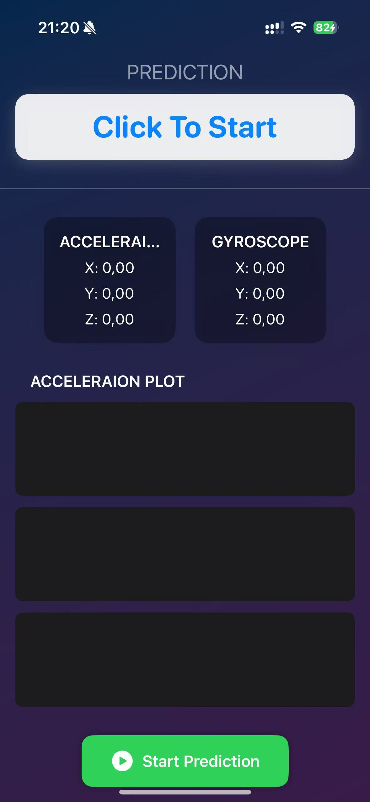
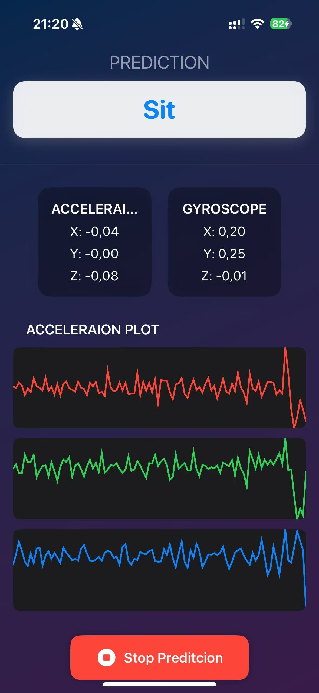
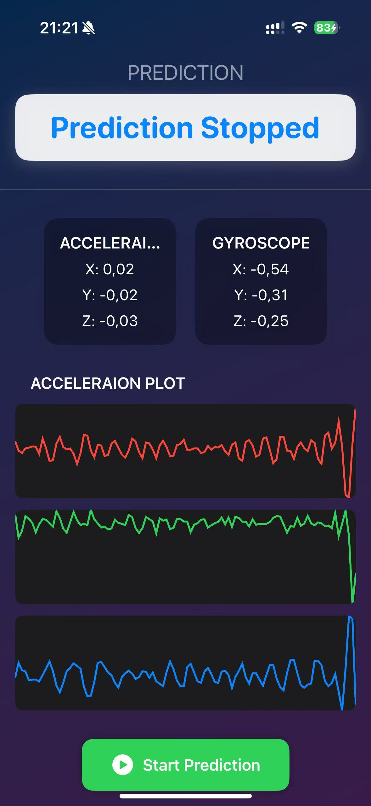

# 🧠 HumanActivityDetector

**HumanActivityClassifier** is a SwiftUI-based iOS application for real-time human activity recognition using CoreMotion sensor data and a CoreML model. The app collects motion data, predicts activities with a sliding window mechanism, and visualizes sensor readings using animated line charts in a modern and elegant UI.

---

## ✨ Features

- 📡 Real-time accelerometer and gyroscope data collection  
- 🧠 Local, offline human activity prediction using a CoreML model  
- 📈 Live sensor data visualization as smooth line graphs  
- 🪟 Sliding window prediction (64-sample window with 50% overlap)  
- 🧱 Clean MVVM architecture with SwiftUI modular components  
- 🎨 Beautiful UI with gradient background and card-style result display  

---


## 🧠 Machine Learning Model

The project uses a custom CoreML model trained to recognize human activities using 6-axis data (accelerometer and gyroscope).

- **Input**:  
  - `MLMultiArray` of shape `[1, 64, 6]`  
    - Each sample includes: `acc_x, acc_y, acc_z, gyro_x, gyro_y, gyro_z`
- **Output**:  
  - Predicted label (e.g., `"Walking"`, `"Running"`, `"Sitting"....`)

---

## 📱 How It Works

1. Tap **Start Prediction** to begin collecting sensor data.
2. The app records sensor readings every ~20ms.
3. Every time 64 samples are collected, the data is fed into the CoreML model.
4. The prediction result is displayed and updated in real-time.
5. The most recent accelerometer data is plotted as a live curve.
6. Tap **Stop Prediction** to halt motion tracking and prediction.

---

## 📦 Tech Stack

- Swift / SwiftUI
- CoreMotion (sensor access)
- CoreML (Deploy DL model on IOS)

---

## 🚀 Getting Started

### 📦 Prerequisites

- Xcode 15 or later  
- iOS 16+ target  
- Swift 5.9+  
- Real iPhone device (CoreMotion does not work on Simulator)

### 🛠️ Build & Run

```bash
git clone https://github.com//HumantwwindeActivityClassifier.git
cd HumanActivityClassifier
open HumanActivityClassifier.xcodeproj

```

1. Select a physical iPhone device.
2. Run the app from Xcode.

## 📊 Live Data Visualization

The app uses a custom LineGraphView to visualize accelerometer data:
- X (Red), Y (Green), Z (Blue) lines
- Smooth transitions with Canvas rendering
- Auto-scales based on incoming values

### 🎬  App UI Overview, Easy Start & Stop Recording

Simple and intuitive UI with clear buttons to start and stop recording activities.


| Prediction Selection| Prediction Selection | Stop Predicition |
| ---------------| --------------- | --------------------- |
| |  |  |


---
## 👨‍💻 Author

[🔗 GitHub - @TWWinde](https://github.com/TWWinde)

If you find this project helpful, feel free to give it a ⭐️ star!
